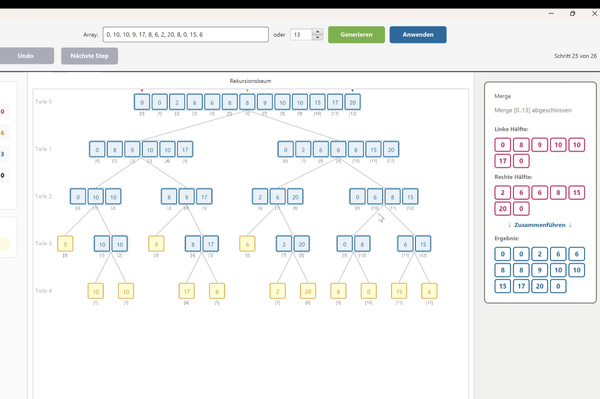
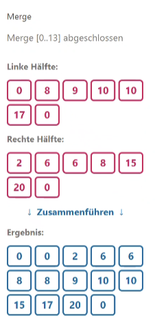

# User-Test: MergeSort Demonstrator

Teilnehmer: Tomas Ferreira (noch nicht Prog1 besucht)

# Anleitung

Öffne den MergeSort Demonstrator mit dem Standard-Array `[5, 2, 7, 9, 6, 2, 1, 0, 8]`.
Beantworte die Fragen indem du das Tool benutzt. Schreibe deine Antworten direkt daneben.

---

## Teil 1: Start & Orientierung

**Frage 1:** Du siehst den Startbildschirm. Wie viele Elemente hat das Array?

> Antwort: __9__ (Erwartet: 9)
> 

**Frage 2:** Welche Tiefe hat ist es Rekursionsbaum?

> Antwort: __0__ (Erwartet: 0)
> 

---

## Teil 2: Divide-Phase

Klicke einmal auf "Nächste Step".

**Frage 3:** Was ist passiert? Beschreibe in eigenen Worten.

> Antwort: **Ursprüngliches Array wurde geteilt, Tiefe ist jetzt 1 (Tiefe nicht ganz verstanden**
> 

**Frage 4:** Bei welchem Index wird das Array geteilt? (Schau auf die Pfeile)

> Antwort: **4 nach linkt 5 nach rechts** (Erwartet: mid = 4)
> 

**Frage 5:** Wie viele Elemente hat die linke Hälfte, wie viele die rechte?

> Antwort: Links: **4** Rechts: **5** (Erwartet: Links: 4, Rechts: 5)
> 

Klicke weiter bis du einen Knoten mit nur einem Element siehst (ein Blatt).

**Frage 6:** Welchen Wert hat das erste Blatt das du siehst?

> Antwort: **5** (Erwartet: 5 oder 2, je nach Beobachtung)
> 

---

## Teil 3: Merge-Phase

Klicke weiter bis ein Merge passiert (Knoten wird blau).

**Frage 7:** Welche zwei Werte wurden zusammengeführt und was ist das Ergebnis?

> Antwort: **2** + __5__ → **[2, 5]** (Erwartet: 2 + 5 → [2, 5])
> 

## Teil 4: Navigation

**Frage 8:** Klicke 3x auf Undo. Was ist die aktuelle Schrittnummer?

> Antwort: **2**
> 

**Frage 9** Klicke auf Reset. Was siehst du jetzt?

> Antwort: **Anfangsarray, schritt 1**
> 

---

## Teil 5: Eigenes Array

Gib das Array `3, 1, 4, 2` ein und klicke "Anwenden".

**Frage 10:** Wie viele Schritte braucht MergeSort für dieses Array? (Klicke bis "Done")

> Antwort: 8
> 

**Frage 12:** Wie sieht das sortierte Ergebnis aus?

> Antwort: [1, 2, 3, 4] (Erwartet: [1, 2, 3, 4])
> 

---

## Teil 6: Verständnis

**Frage 13:** Erkläre in einem Satz was "Divide" bedeutet.

> Antwort: **Ein devide teilt das array und es wird so lang gemacht bis es ein element hat**
> 

**Frage 14:** Erkläre in einem Satz was "Merge" bedeutet.

> Antwort: **ein merge nimmt zwei arrays und fügt sie zusammen in dem es vergleicht und richtig sortiert**
> 

**Frage 15:** Was hat dir am meisten geholfen den Algorithmus zu verstehen? Was war verwirrend?

> Geholfen: **Rekursionsbaum hat visuell sehr geholfen, die Schritte**, **Wenn es ein grosses Array ist hilft das panel rechts**
Verwirrend: **Ich habe lange gebraucht bis ich die Schrittanzeige gesehen habe, Mid habe ich nicht ganz verstanden**
> 

## Bug gefunden:
Es wird eine Zahl zuviel angezeigt beim Ergebnis

